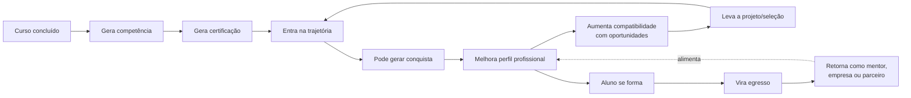
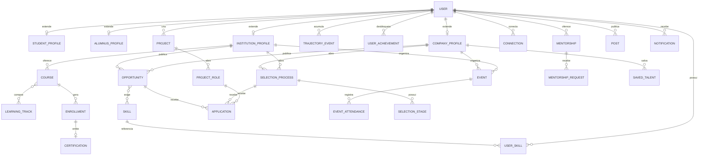

# UniConnect — Contexto do Produto

> **A graduação termina. A conexão não.**
> Estude · Conecte · Conquiste

Este documento consolida a visão completa do produto: o problema, os usuários, os módulos funcionais e o modelo de dados conceitual. Ele é a fonte da verdade sobre **o que o UniConnect é**. Para identidade visual, veja [`design.md`](./design.md); para a ordem de implementação, veja [`roadmap.md`](./roadmap.md).

---

## 1. Visão e proposta de valor

O UniConnect é uma **rede acadêmica, profissional e de oportunidades** que conecta universidades, alunos, egressos e empresas em um único perfil contínuo.

**Problema:** não existe continuidade entre a vida acadêmica e a vida profissional. A universidade perde contato com o egresso, o egresso perde vínculo com a universidade, e o mercado não enxerga com clareza os talentos que estão sendo formados.

**Proposta de valor:** transformar toda a jornada — cursos, certificações, projetos, eventos, seleções, competências e conexões — em uma **trajetória profissional contínua**, construída automaticamente a partir de atividades reais, e usá-la para conectar pessoas a oportunidades antes, durante e depois da graduação.

---

## 2. Usuários e perfis

| Perfil | Quem é | Capacidades principais |
|---|---|---|
| **Aluno** | Estudante ativo em uma instituição | Perfil acadêmico/profissional, trajetória, competências, conquistas, projetos, candidaturas, networking, mentoria (como aprendiz) |
| **Egresso** | Ex-aluno formado | Tudo que o aluno tem, **mais**: oferecer mentoria, criar projetos, divulgar vagas, contratar talentos, manter vínculo institucional |
| **Empresa** | Organização parceira ou externa | Vagas, processos seletivos, projetos, busca de talentos, perfis salvos, participação em eventos |
| **Instituição** | Universidade/faculdade parceira | Gestão de alunos/egressos, cursos, trilhas, certificações, eventos, seleções, projetos, oportunidades, mentorias, analytics |

O perfil do **aluno não é substituído** ao se formar — ele evolui para egresso, mantendo toda a trajetória acumulada. Essa continuidade é o núcleo do produto (ver [seção 6](#6-o-loop-de-integração-central)).

---

## 3. Módulos funcionais

### 3.1 Academia (cursos, trilhas, certificações)

Modelo inspirado em plataformas como a DIO.

- **Cursos**: publicados por instituições; podem ser públicos, exclusivos para alunos da instituição, exclusivos para egressos, exclusivos por curso/graduação, ou exclusivos para instituições parceiras.
- **Trilhas**: conjuntos de cursos organizados por objetivo (ex.: *Backend → Python → APIs → FastAPI → PostgreSQL → Docker → Projeto final*).
- **Certificações**: emitidas pela instituição ao concluir curso/trilha, com carga horária, competências adquiridas, data de conclusão, código de verificação e validação pública.

### 3.2 Trajetória

Timeline automática da vida acadêmica/profissional do usuário: ingresso, disciplinas/atividades relevantes, cursos, certificações, projetos, pesquisa, extensão, monitoria, eventos, hackathons, seleções, estágios, empregos, conquistas, formatura, atuação como egresso.

O objetivo é que o usuário **nunca precise montar um currículo do zero** — a trajetória é derivada das ações que ele já realiza na plataforma.

### 3.3 Competências

Competências são agregadas automaticamente a partir de cursos, certificações, projetos, experiências, eventos e seleções (ex.: `Python · React · PostgreSQL · Git · Docker`). Alimentam diretamente a [busca](#37-busca) e o [cálculo de compatibilidade](#38-compatibilidade).

### 3.4 Conquistas

Reconhecimento baseado em atividades reais (primeiro curso concluído, primeira certificação, hackathon, projeto concluído, pesquisador, mentor, 10 eventos, destaque acadêmico...). Gamificação leve — **meio, não objetivo principal**.

### 3.5 Projetos e formação de equipes

Qualquer usuário autorizado pode criar um projeto (nome, descrição, objetivo, área, tecnologias, duração, modalidade, instituição vinculada, nº de integrantes, competências necessárias, tipo de remuneração, público-alvo de visibilidade).

Um projeto pode abrir **vagas internas** (ex.: 1 Backend, 1 Frontend, 1 Designer), direcionadas a uma universidade, curso, semestre, egressos, competências específicas ou público geral. Usuários demonstram interesse, se candidatam, podem ser convidados ou passar por seleção.

### 3.6 Eventos e presença

Instituições, empresas e usuários autorizados criam eventos (palestras, workshops, congressos, hackathons, feiras, minicursos, networking, eventos de egressos, competições, processos seletivos, atividades acadêmicas), com visibilidade pública, privada, institucional, por curso/turma, por convite ou interinstitucional.

**Check-in** via geolocalização/geofence, QR Code ou ambos — usado apenas para *validar presença pontual*, sem rastreamento contínuo. A presença confirmada pode gerar: registro na trajetória, horas de participação, certificado, competência e conquista.

### 3.7 Seleções

Processos seletivos com etapas configuráveis (inscrição → análise → teste → entrevista → resultado), abertos por universidade ou empresa para bolsas, monitorias, extensão, pesquisa, estágio, vagas de empresas, projetos ou programas internos. O candidato acompanha o status em tempo real.

### 3.8 Oportunidades

Categoria ampla, não restrita a emprego: estágio, emprego, trainee, freelance, bolsa, pesquisa, extensão, monitoria, projeto, voluntariado, intercâmbio, hackathon, seleção.

### 3.9 Busca

Busca unificada para pessoas, cursos, certificações, projetos, eventos, oportunidades, empresas e competências, com filtros por instituição, curso, área, competência, localização, modalidade, nível e tipo.

**Busca aproximada com `pg_trgm`** (PostgreSQL) para tolerar erros de digitação sem depender de IA — ex.: `Pyton → Python`, `Postgress → PostgreSQL`, `backand → Backend`.

### 3.10 Compatibilidade

Cálculo **baseado em regras**, não em IA: interseção entre as competências do usuário e as exigidas pela oportunidade.

> Aluno tem `Python + FastAPI + PostgreSQL + Docker`. Vaga exige `Python + FastAPI + PostgreSQL + AWS`. Resultado: **3/4 → 75% de compatibilidade.**

### 3.11 Networking e mentorias

- **Networking**: conectar-se, seguir pessoas, pesquisar profissionais, encontrar colegas/egressos/profissionais por área.
- **Mentorias**: egressos e profissionais se oferecem como mentores (área, competências, assuntos, disponibilidade). O aluno solicita; após aceite, os dois ficam conectados.

### 3.12 Comunidade e notificações

- **Feed** interno para projetos, conquistas, oportunidades, eventos, certificações, experiências, conteúdos e novidades institucionais.
- **Notificações** para novas oportunidades, eventos, seleções, cursos, certificações, convites para projetos, solicitações de mentoria, conexões e mudanças em processos seletivos.

### 3.13 Empresas e talentos

Empresas buscam pessoas por competência, curso, instituição, experiência, projetos, certificações e interesses; podem visualizar perfis, salvar talentos, convidar, abrir vagas e criar processos seletivos.

### 3.14 Gestão universitária e analytics

Painel institucional para administrar alunos, egressos, empresas, cursos, trilhas, certificados, eventos, seleções, projetos, oportunidades, mentorias e conquistas.

**Indicadores**: alunos ativos, egressos, participação, cursos concluídos, certificações, eventos, projetos, candidaturas, oportunidades, contratações, competências mais desenvolvidas, empresas parceiras, empregabilidade — incluindo identificação de **alunos com baixa participação**, para aproximação proativa da instituição.

**Empregabilidade de egressos**: onde trabalham, áreas de atuação, empresas contratantes, competências demandadas, % empregado, empreendedorismo, pós-graduação, pessoas em busca de oportunidade.

### 3.15 Privacidade e permissões

O usuário controla a visibilidade do próprio perfil (público / somente instituição / somente empresas / somente conexões). Cursos, eventos, projetos e seleções também têm regras próprias de visibilidade e permissão de acesso.

---

## 4. Fora do escopo (por enquanto)

**IA não entra no MVP.** A primeira versão usa apenas: PostgreSQL, busca tradicional, `pg_trgm`, filtros e regras de compatibilidade — dados estruturados, sem modelos de recomendação.

Fica para depois: recomendação inteligente de cursos, recomendação de vagas, matching aluno↔empresa, matching pessoa↔projeto, matching mentor↔aluno, análise de trajetória e assistente de carreira.

---

## 5. O loop de integração central

O diferencial do produto é que **tudo alimenta o mesmo perfil**:

---

## 6. Modelo de dados conceitual

Entidades principais e como se relacionam (nível conceitual — o schema físico é definido durante a implementação, ver [`roadmap.md`](./roadmap.md)).

**Notas de projeto:**

- `TRAJECTORY_EVENT` é **polimórfica**: cada evento referencia sua origem (matrícula, certificação, projeto, evento, seleção, experiência). É a materialização da [seção 3.2](#32-trajetória).
- `USER_SKILL` guarda a **origem** da competência (curso, certificação, projeto, evento, seleção), permitindo auditoria e cálculo de compatibilidade.
- `APPLICATION` é genérica e pode apontar para `OPPORTUNITY`, `PROJECT_ROLE` ou `SELECTION_PROCESS` — evita triplicar a lógica de candidatura.
- Compatibilidade ([3.10](#310-compatibilidade)) é calculada em consulta, comparando `USER_SKILL` do candidato com as `SKILL` exigidas pela `OPPORTUNITY` — não é uma coluna persistida.
- Visibilidade/permissão ([3.15](#315-privacidade-e-permissões)) é um atributo transversal (`visibility`) presente em `USER`, `COURSE`, `EVENT`, `PROJECT` e `SELECTION_PROCESS`, não uma entidade própria.

---

## 7. Em uma frase

> Uma plataforma que transforma toda a jornada acadêmica — cursos, certificações, projetos, eventos, seleções, competências e conexões — em uma trajetória profissional contínua, conectando estudantes, universidades, egressos e empresas antes, durante e depois da graduação.
